# SalesPredictor por Maximo Mora 

## Descripción:

SalesPredictor es un (PMN) que es un sistema  de predicción de ventas:

## 🛠️ Instalación

### Requisitos:
 - bun, 
 - python3

### Frontend: 

 - cd frontend

 - bun install

 - bun run dev

### Backend:

 - python -m venv venv (desde la raiz de proyecto)

 - pip install -r backend/requirements.txt

 - cd backend

 - python app.py

------------------------------------------------

```mermaid

graph TD
    A[Login] -->|Acceder| B[Menu]
    B -->|Dashboard| C[Dashboard]
    B -->|Sobre Nosotros| D[Sobre Nosotros]
    B -->|Usuarios| E[Usuarios]
    B -->|Cerrar Sesión| A

    style A fill:#4CAF50,stroke:#388E3C
    style B fill:#2196F3,stroke:#1976D2
    style C fill:#FF9800,stroke:#F57C00
    style D fill:#009688,stroke:#00796B
    style E fill:#E91E63,stroke:#C2185B

```

